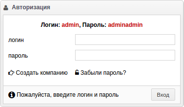

Начала
======

Вход в систему
##############

Если вы установили и запустили TravelCRM как было описано `здесь <install.html>`_,
откройте ваш браузер по адресу::

   http://localhost:6543

Введите логин и пароль для входа. По умолчанию это: **admin** и **adminadmin**

.. image:: _static/_images/login.png

Режим мультикомпаний
####################
Режим мультикомпаний разрешает регистрацию произвольных компаний со своими 
собствеными CRM. Это может быть полезно, если вы хотите использовать TravelCRM 
в качестве платформы для создания собственного SaaS сервиса.
Для регистрации компании перейдите по ссылке "Создать компанию"

Заполните все поля на странице регистрации новой компании и ожидайте письмо со
ссылкой на ваш экземпляр TravelCRM на указанный при регистрации email.

.. image:: 
   _static/_images/company_creation.png

.. note:: 
   Для новых компаний создается новая схема в базе данных и экземпляр TravelCRM
   доступен для них через отдельный субдомен. Таким образом все данные для компаний
   изолированы друг от друга, что исключает вероятность несанкционированного
   доступа к данным разных компаний.

Элементы рабочего стола
#######################
Рабочий стол в TravelCRM состоит из трех частей: меню навигации, рабочего 
пространства и панели инструментов.

.. image:: 
   _static/_images/workspace.png

1. Меню навигации
2. Рабочее пространство
3. Панель инструментов

Меню навигации
##############
Содержит рабочие пункты меню. Меню навигации полностью конфигурируемо 
и его содержание зависит от должности текущего пользователя. Кнопка "Обновить"
обновляет содержимое меню навигации без перезагрузки рабочего пространства. Это
бывает полезно после редактирования содержания меню для должности.

Рабочее пространство
####################
Рабочее пространство содержит вкладки с открытыми типами ресурсов. По умолчанию
открыта только основная вкладка - Домашняя. При клике на меню навигации будут 
открываться вкладки с другими типами ресурсов. Хотя стоит заметить, что не все
типы ресурсов могут открываться во вкладках - это зависит от настроек пунктов
навигационного меню и технической реализации конкретного типа ресурсов.

Панель инструментов
###################
Состоит из трех типов ресурсов: задач, заметок и уведомлений.
В список задач попадают все задачи, назначенные на текущего пользователя.
